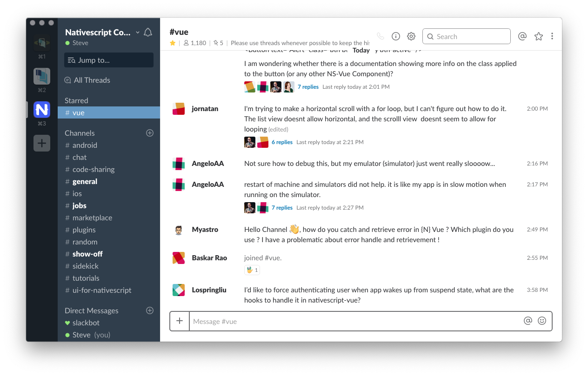

# slackIRC
Inspired by [**Slack IRC Layout**](https://userstyles.org/styles/104279/slack-irc-layout), which sadly no longer works. Installation methods inspired by @laCour in [this discussion](https://github.com/laCour/slack-night-mode/issues/73#issuecomment-287467332).



## Installation
### Browser
Install a [user styles extension](https://github.com/openstyles/stylus/wiki/Stylish-Alternatives) for your browser and add the contents of `style.css` as a new user style applied to `slack.com`

### Desktop

It's hacky, but it works. Note that you will have to redo this every time Slack updates.

⚠️ **WARNING** ⚠️ This will request the compiled CSS file from this repository. You are strongly discouraged from using a remote CSS file that is not under your control. It's recommended that you create your own copy. An XSS attack could put your Slack client at risk.

#### Automatic
Run `./install.sh` in your terminal.

#### Manual
Edit the file `ssb-interop.js` inside the Slack app. For example:

* macOS: `/Applications/Slack.app/Contents/Resources/app.asar.unpacked/src/static/ssb-interop.js`

* Linux: `/usr/lib/slack/resources/app.asar.unpacked/src/static/ssb-interop.js`

Add the following chunk of code to the bottom of this file:
```javascript
document.addEventListener('DOMContentLoaded', function() {
  $.ajax({
    url: 'https://raw.githubusercontent.com/lvarado/slackIRC/master/style.css',
    success: function(css) {
      $("<style></style>").appendTo('head').html(css);
    }
  });
});
```

Quit and restart Slack, or press CMD/CTRL+R to reload
